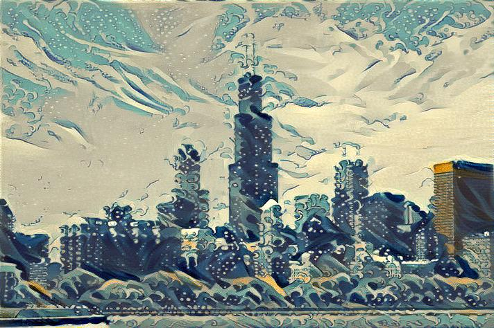

# Neural Style Transfer
### Implementation of Gatys et al. algorithm using Tensorflow 2

The following repository contains an implementation of the Neural Style Transfer algorithm described by Gatys et al. in their paper [A Neural Algorithm of Artistic Style](https://arxiv.org/pdf/1508.06576).
The algorithm has been implemented using Tensorflow 2, and unlike many existing implementations, it has been written using its new *eager execution* feature. It also deploys Tensorflow's built-in VGG model, included in the Keras module.

### Background of the algorithm
The original algorithm, the one implemented in this repository, is of an iterative nature: a randomly generated initial image successively converges to the desired image, one mixing both the **content** of an image and the **style**  of another. 

    
    

Output:

    

At each iteration, a loss function is evaluated, its gradient computed, and the image being iterated, updated. The loss function is made up of 2 parts:

* Content loss : loss aimed to evaluate how close the content of an image is to the original content of the reference image. Let  be a given layer,   the function that computes the flattened feature maps of that layer  for a given image . Then, the content loss at each iteration is defined as , where  is the original reference image, and  the image being iterated. 
* Style loss : similarly, loss aimed to evaluate how close the style of two images are from one another. Let  be a sequence of layers. Let  be the Gram Matrix of the flattened feature maps of layer  for an input image . Then, the style loss is defined as the sum over all  of .

The total loss  is defined as , where  and  are fixed weights. 

### Details

The source code includes:
* A Python script named `main-transfer.py`, which transfers the style of an image to another image. The script is designed either to be called using command-line arguments, or be imported as a Python module to be used at other projects.
* A Jupyter notebook, with the same code as the `main-transfer.py` file, but explaining thoroughly each step. This file is aimed both to do further research with the code and give some insight on how Tensorflow works.

When executing the script through the command-line, several arguments are required, although all of them come with a default value. Please, execute `python src/main-transfer.py --help` to get help for the arguments. All default values are contained inside the `src/constants.py` file.

When executing `python src/main-transfer.py`, the script will look for the image `data/input-example.jpg`, which will be the content image, and the image `data/style-example.jpg`, and will transfer the style of the latter to the former. The result, after 3000 iterations (epochs), can be found at `out_example3000.jpg`. These images can be changed using command-line arguments as described in the previous section. 

The code has been developed (or tested) in the following platform; see the `requirements.txt` file for further information on Python modules' versions:
* Ubuntu 18.04.03 / Windows 10 Pro version 1909 18363.959
* Tensorflow 2.2.0